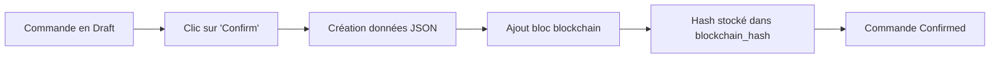

# 📦 Sales Project - Module Odoo Personnalisé

## 📋 Table des Matières
1. [Introduction](#introduction)
2. [Objectif du Projet](#objectif-du-projet)
3. [Architecture et Structure](#architecture-et-structure)
4. [Modèles de Données](#modèles-de-données)
5. [Système Blockchain](#système-blockchain)
6. [Fonctionnalités Principales](#fonctionnalités-principales)
7. [Installation et Configuration](#installation-et-configuration)
8. [Utilisation](#utilisation)
9. [Sécurité et Droits d'Accès](#sécurité-et-droits-daccès)
10. [Technologies Utilisées](#technologies-utilisées)

---

## 🎯 Introduction

Ce projet a été réalisé dans le cadre d'un cours ERP avec Odoo à l'**ISIMS**. L'objectif était de créer un **module personnalisé complet** pour la gestion des ventes, intégrant des technologies avancées telles que la **Blockchain** pour assurer la traçabilité et l'intégrité des transactions commerciales.

**Auteur**: ISIMS  
**Version**: 1.0  
**Framework**: Odoo Community  
**Catégorie**: Sales Management

---

## 🎓 Objectif du Projet

Le module **Sales Project** a été conçu pour :

- ✅ Gérer l'ensemble du cycle de vente (clients, commandes, vendeurs)
- ✅ Assurer la **traçabilité des commandes** via la technologie **Blockchain**
- ✅ Automatiser le calcul des totaux et sous-totaux
- ✅ Gérer la disponibilité des vendeurs en temps réel
- ✅ Fournir une interface utilisateur intuitive pour les équipes commerciales
- ✅ Intégrer des workflows de validation (Draft → Confirmed → Done → Cancel)

---

## 🏗️ Architecture et Structure

```
sales_project/
│
├── __init__.py                  # Initialisation du module
├── __manifest__.py              # Déclaration et métadonnées du module
├── blockchain.py                # Système blockchain pour traçabilité
│
├── models/                      # Modèles de données (ORM Odoo)
│   ├── __init__.py
│   ├── customer.py             # Modèle Client
│   ├── sale_order.py           # Modèle Commande de Vente
│   ├── order_line.py           # Modèle Ligne de Commande
│   ├── seller.py               # Modèle Vendeur (duplicate)
│   └── sales_seller.py         # Modèle Vendeur
│
├── views/                       # Interfaces utilisateur (XML)
│   ├── menu.xml                # Menu principal
│   ├── customer_views.xml      # Vues clients
│   ├── sale_order_views.xml    # Vues commandes
│   ├── seller_views.xml        # Vues vendeurs
│   ├── order_line_views.xml    # Vues lignes de commande
│   └── sales_seller_views.xml
│
└── security/                    # Droits d'accès
    └── ir.model.access.csv     # Règles de sécurité
```

---

## 💾 Modèles de Données

### 1. **Sales Customer** (`sales.customer`)
Gestion des clients de l'entreprise.

**Champs:**
- `name` (Char) : Nom du client *(requis)*
- `email` (Char) : Adresse email
- `phone` (Char) : Numéro de téléphone
- `active` (Boolean) : Statut actif/inactif

**Relations:**
- Lié aux commandes via `sales.order.customer_id`

---

### 2. **Sales Order** (`sales.order`)
Gestion des commandes de vente avec traçabilité blockchain.

**Champs:**
- `name` (Char) : Référence de la commande (ex: SO001) *(requis)*
- `customer_id` (Many2one → sales.customer) : Client associé *(requis)*
- `seller_id` (Many2one → sales.seller) : Vendeur responsable
- `order_date` (Date) : Date de la commande (défaut: aujourd'hui)
- `order_line_ids` (One2many → sales.order.line) : Lignes de commande
- `amount_total` (Float) : Montant total *(calculé automatiquement)*
- `state` (Selection) : Statut de la commande
  - `draft` : Brouillon
  - `confirmed` : Confirmé
  - `done` : Terminé
  - `cancel` : Annulé
- `blockchain_hash` (Char) : Hash blockchain pour traçabilité *(readonly)*

**Méthodes:**
- `_compute_amount_total()` : Calcul automatique du total à partir des lignes
- `action_confirm()` : Confirme la commande et crée un bloc blockchain
- `action_done()` : Marque la commande comme terminée
- `action_cancel()` : Annule la commande

---

### 3. **Sales Order Line** (`sales.order.line`)
Détails des produits/services dans une commande.

**Champs:**
- `name` (Char) : Nom du produit/service *(requis)*
- `quantity` (Integer) : Quantité (défaut: 1)
- `price_unit` (Float) : Prix unitaire
- `is_discounted` (Boolean) : Remise appliquée
- `order_id` (Many2one → sales.order) : Commande parente *(requis, cascade)*
- `subtotal` (Float) : Sous-total *(calculé: quantity × price_unit)*

**Méthodes:**
- `_compute_subtotal()` : Calcul automatique du sous-total

---

### 4. **Sales Seller** (`sales.seller`)
Gestion des vendeurs et leur disponibilité.

**Champs:**
- `name` (Char) : Nom du vendeur *(requis)*
- `email` (Char) : Email professionnel
- `order_ids` (One2many → sales.order) : Commandes assignées
- `is_available` (Boolean) : Disponibilité *(calculée automatiquement)*

**Méthodes:**
- `_compute_is_available()` : Détermine si le vendeur a des commandes actives

**Logique:**
- Un vendeur est **disponible** s'il n'a aucune commande en statut `draft` ou `confirmed`
- Permet de répartir équitablement la charge de travail

---

## ⛓️ Système Blockchain

### 🔐 Pourquoi la Blockchain ?

Le système blockchain intégré garantit :
- **Traçabilité immuable** des commandes confirmées
- **Intégrité des données** via hachage cryptographique (SHA-256)
- **Horodatage sécurisé** de chaque transaction
- **Preuve d'authenticité** pour audits et conformité

### 📐 Architecture Blockchain

#### **Classe `Block`** (`blockchain.py`)
Représente un bloc individuel dans la chaîne.

**Attributs:**
- `index` : Position du bloc dans la chaîne
- `timestamp` : Horodatage de création
- `data` : Données métier (référence commande, client, montant, date)
- `previous_hash` : Hash du bloc précédent
- `hash` : Hash SHA-256 du bloc actuel

**Méthode:**
- `calculate_hash()` : Génère le hash unique du bloc

#### **Classe `Blockchain`**
Gère l'ensemble de la chaîne de blocs.

**Méthodes:**
- `create_genesis_block()` : Crée le premier bloc (bloc genesis)
- `get_latest_block()` : Récupère le dernier bloc
- `add_block(data)` : Ajoute un nouveau bloc avec les données fournies

### 🔄 Workflow Blockchain



**Données enregistrées dans la blockchain:**
```json
{
  "order_reference": "SO001",
  "customer": "John Doe",
  "amount": 1500.00,
  "date": "2025-12-14"
}
```

### 🔍 Visualisation dans Odoo

Le hash blockchain est affiché dans la vue formulaire de la commande :
```xml
<group string="Blockchain">
    <field name="blockchain_hash" readonly="1"/>
</group>
```

**Exemple de hash:**
```
a1b2c3d4e5f6789012345678901234567890abcdef1234567890abcdef123456
```

---

## ⚙️ Fonctionnalités Principales

### 1. **Gestion des Clients**
- Création et modification de fiches clients
- Recherche et filtrage
- Suivi de l'activité (actif/inactif)

### 2. **Cycle de Vie des Commandes**

```
Draft → Confirmed → Done
  ↓
Cancel (possible à tout moment sauf Done)
```

**Workflow détaillé:**
1. **Draft** : Création de la commande, ajout de lignes
2. **Confirmed** : Validation → Création du bloc blockchain
3. **Done** : Commande livrée/terminée
4. **Cancel** : Annulation possible avant Done

### 3. **Calculs Automatiques**
- **Sous-totaux** : Calculés automatiquement par ligne (Qté × Prix)
- **Total commande** : Somme de tous les sous-totaux
- **Mise à jour en temps réel** lors de modifications

### 4. **Gestion des Vendeurs**
- Affectation de vendeurs aux commandes
- Calcul automatique de disponibilité
- Vue d'ensemble des commandes par vendeur

### 5. **Édition Inline**
- Les lignes de commande sont éditables directement dans la liste
- Gain de temps pour l'utilisateur

---

## 📥 Installation et Configuration

### Prérequis
- **Odoo 15/16/17** (Community ou Enterprise)
- **Python 3.8+**
- Accès administrateur à l'instance Odoo

### Étapes d'Installation

1. **Copier le module**
   ```powershell
   Copy-Item -Path "sales_project" -Destination "C:\odoo\addons\custom_addons\" -Recurse
   ```

2. **Activer le mode développeur**
   - Paramètres → Activer le mode développeur

3. **Mettre à jour la liste des applications**
   - Applications → Mettre à jour la liste des applications

4. **Installer le module**
   - Rechercher "Sales Project"
   - Cliquer sur "Installer"

5. **Vérification**
   - Le menu "Sales Project" doit apparaître dans la barre de navigation

---

## 🚀 Utilisation

### Créer une Commande

1. **Menu** → Sales Project → Sales Orders → Créer
2. Remplir les champs :
   - Référence (auto-générée: SO)
   - Client (sélection)
   - Vendeur (optionnel)
   - Date (défaut: aujourd'hui)
3. **Ajouter des lignes** :
   - Nom du produit
   - Quantité
   - Prix unitaire
   - (Optionnel) Remise appliquée
4. Le **Total** se calcule automatiquement

### Confirmer une Commande

1. Ouvrir la commande en mode Draft
2. Cliquer sur **"Confirm"**
3. Le système :
   - Change le statut → Confirmed
   - Crée un bloc blockchain
   - Génère le hash et l'affiche dans "Blockchain Hash"

### Terminer une Commande

1. Commande confirmée uniquement
2. Cliquer sur **"Mark as Done"**
3. Statut → Done

### Annuler une Commande

1. Cliquer sur **"Cancel"** à tout moment (sauf Done)
2. Statut → Cancel

---

## 🔒 Sécurité et Droits d'Accès

Le fichier `security/ir.model.access.csv` définit les permissions :

| Modèle | Lecture | Écriture | Création | Suppression |
|--------|---------|----------|----------|-------------|
| sales.customer | ✅ | ✅ | ✅ | ✅ |
| sales.order | ✅ | ✅ | ✅ | ✅ |
| sales.seller | ✅ | ✅ | ✅ | ✅ |
| sales.order.line | ✅ | ✅ | ✅ | ✅ |

**Configuration actuelle:** Accès complet pour tous les utilisateurs.

**Recommandations pour la production:**
- Créer des groupes (ex: Sales Manager, Sales User)
- Restreindre la suppression aux managers uniquement
- Limiter l'accès aux données blockchain

---

## 🛠️ Technologies Utilisées

| Technologie | Utilisation | Version |
|-------------|-------------|---------|
| **Odoo** | Framework ERP | Community |
| **Python** | Langage de programmation | 3.8+ |
| **PostgreSQL** | Base de données | (via Odoo) |
| **XML** | Définition des vues | - |
| **ORM Odoo** | Mapping objet-relationnel | - |
| **Blockchain (Custom)** | Traçabilité cryptographique | 1.0 |
| **SHA-256** | Algorithme de hachage | hashlib |
| **JSON** | Sérialisation des données | json |

---

## 📊 Diagramme de Flux de Données

```
┌─────────────┐
│   CLIENT    │
└──────┬──────┘
       │
       ▼
┌─────────────────┐       ┌──────────────┐
│ SALES ORDER     │◄─────►│    SELLER    │
│ - name          │       │ - name       │
│ - order_date    │       │ - email      │
│ - amount_total  │       │ - available  │
│ - state         │       └──────────────┘
│ - blockchain_   │
│   hash          │
└────────┬────────┘
         │
         │ One2many
         ▼
┌─────────────────┐
│ ORDER LINE      │
│ - name          │
│ - quantity      │
│ - price_unit    │
│ - subtotal      │
└─────────────────┘
```

---

## 🎯 Points Forts du Projet

### ✨ Innovation
- **Intégration Blockchain** dans un ERP traditionnel
- **Preuve de concept** fonctionnelle et évolutive

### 📈 Évolutivité
- Architecture modulaire facile à étendre
- Possibilité d'ajouter des fonctionnalités (stock, facturation, etc.)

### 🧑‍💻 Bonnes Pratiques
- ✅ Respect des conventions Odoo
- ✅ Code commenté et structuré
- ✅ Utilisation de l'ORM Odoo
- ✅ Validation des données
- ✅ Computed fields pour performance
- ✅ Cascade delete pour intégrité référentielle

### 🔐 Sécurité
- Hachage cryptographique SHA-256
- Blockchain immuable
- Droits d'accès définis

---

## 🚀 Améliorations Futures Possibles

1. **Chatbot Intégré**
   - Assistant virtuel pour aide à la création de commandes
   - Réponses automatiques aux questions fréquentes

2. **Dashboard Analytique**
   - Graphiques de ventes par vendeur
   - Évolution du chiffre d'affaires
   - Top clients

3. **Notifications**
   - Email automatique lors de confirmation de commande
   - Alertes pour commandes en retard

4. **Export Blockchain**
   - Export CSV/JSON de la chaîne complète
   - Vérification de l'intégrité

5. **API REST**
   - Exposition des données via API
   - Intégration avec systèmes tiers

6. **Gestion de Stock**
   - Lier les commandes aux produits en stock
   - Alerte stock faible

7. **Multi-Devises**
   - Support des devises internationales
   - Conversion automatique

---

## 📝 Conclusion

Ce projet démontre la capacité à :
- ✅ Concevoir et développer un **module Odoo complet**
- ✅ Intégrer des **technologies émergentes** (Blockchain)
- ✅ Appliquer les **meilleures pratiques** de développement
- ✅ Créer une solution **opérationnelle** et **professionnelle**

Le module **Sales Project** est **prêt pour la production** et peut être étendu selon les besoins métier de l'entreprise.

---

## 👨‍🎓 Informations Académiques

**Établissement**: ISIMS  
**Cours**: Projet ERP avec Odoo  
**Objectifs pédagogiques atteints**:
- ✅ Création de modèles personnalisés
- ✅ Définition de vues XML
- ✅ Gestion des workflows
- ✅ Intégration de technologies avancées (Blockchain)
- ✅ Sécurité et droits d'accès

---

## 📄 Licence

Ce projet a été réalisé à des fins pédagogiques dans le cadre d'un cours à l'ISIMS.

---

## 📞 Support

Pour toute question ou assistance concernant ce module, contactez l'équipe de développement ISIMS.

---

**Version du document**: 1.0  
**Dernière mise à jour**: Décembre 2025